# Will the Customer accept the coupon

## Overview
The goal of this project is to use all that I have learned so far in last 4 weeks with respect to panda, data visualization and probability distributions to distinguish between customers who accepted one type of coupon versus not. This partition is studied by segregating the customer into 2 groups and figuring out their acceptance rates. The groups are formed by restricting number of features together to a certain values or ranges.

The whole exploration is done in the [notebook](./notebooks/BarCouponsAndExploration.ipynb)

## Exercise Questions and Exploration of Bar Coupons

Following steps were taken to clean up the data:
1. All the columns were analyzed with respect to number of null values in them.
2. The columns were divided into numerical features and categorical features:
 - __Numerical Features__: temperature, has_children, toCoupon_GEQ5min, toCoupon_GEQ15min, toCoupon_GEQ25min, direction_same, direction_opp, Y.
 - __Categorical Features__: destination, passenger (passanger), weather, time, coupon, expiration, gender, age, maritalStatus, education, occupation, income, car, Bar, CoffeeHouse, CarryAway, RestaurantLessThan20, Restaurant20To50.
3. Unique values in each column were studied.
4. Based on above analysis following steps were performed to clean up the data:
 - **car** column was entirely dropped as it has very few valid values (108 out of 12684)
 - **toCoupon_GEQ5min**, **toCoupon_GEQ15min**, **toCoupon_GEQ25min** were also dropped as I didn't intend to use them in my exploration of the data.
 - all rows with null values were dropped, and now the data has 12079 rows from the original rows of 12684
 - I also renamed the column **Y** to **Accepted** to ease during plotting.

#### Answers
* __What proportion of the total observations chose to accept the coupon?__  
``Proportion of accepted coupons:  0.57``

* __Bar Plot to Visualize the coupon column__  
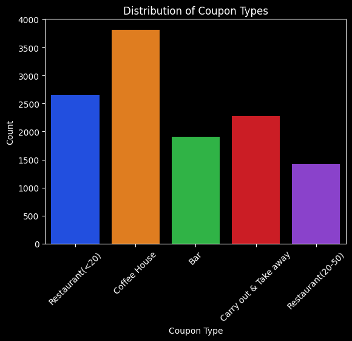

* __Use a histogram to visualize the temperature column__  
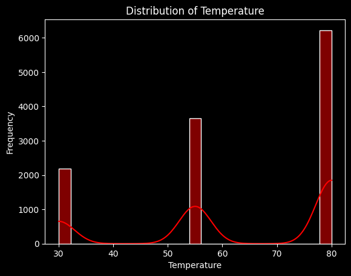  

* __Observations from the distribution of various columns__

|S. No.| Observation | Plot |
| -------- | ---------- | ------- |
| 1. | Direction of Travel is skewed towards driving in opposite direction |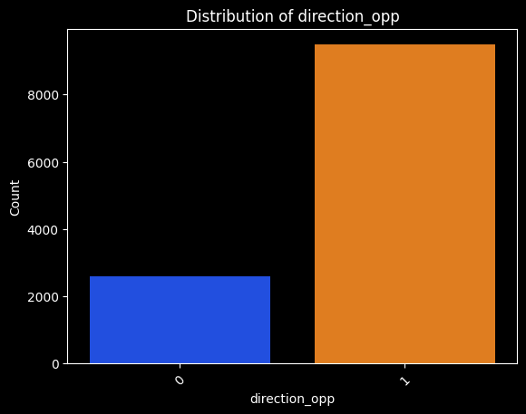|
| 2. | For Coupons frequency of visits in some cases are skewed for a particular group |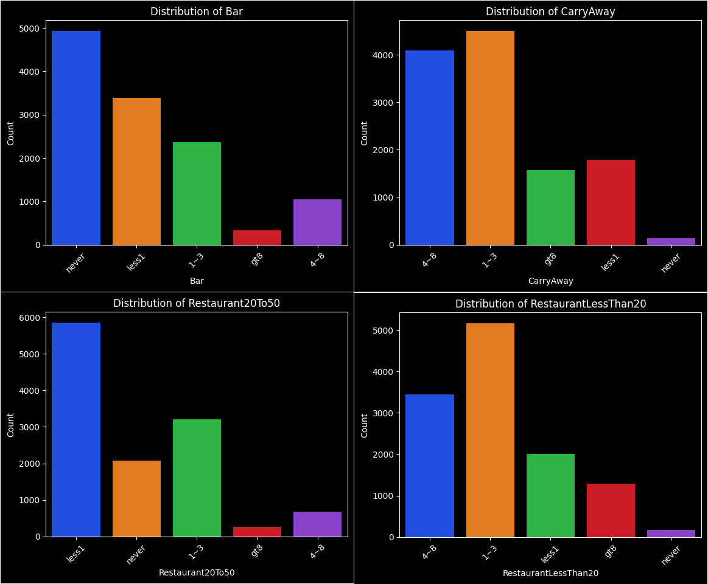|
| 3. | With respect to Marital status widowed are not aptly represented. |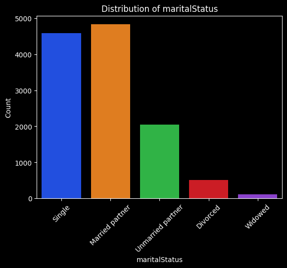|
| 4. | Occupation categories are not equally represented. |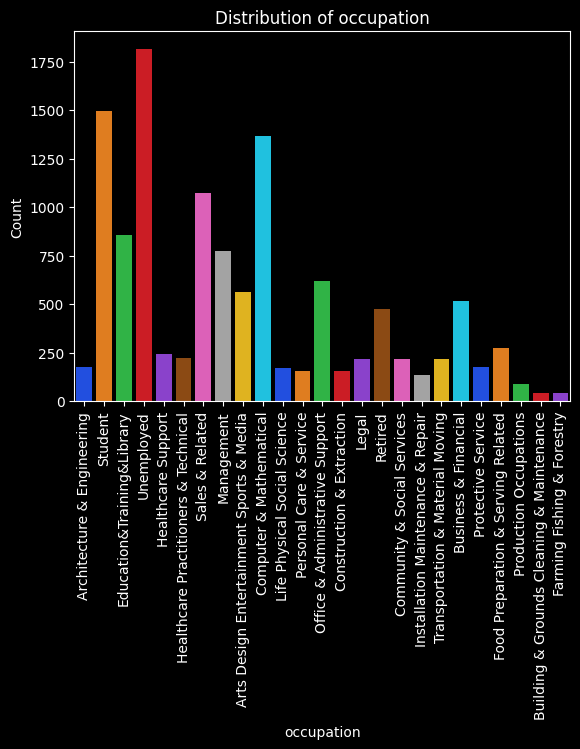|
| 5. | With respect to weather, most entries corresponds to sunny weather.|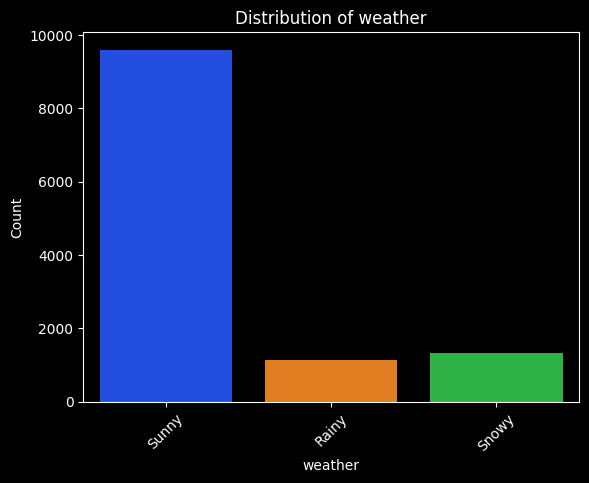|

### Investigating Bar Coupons
#### Answers
* __What proportion of bar coupons were accepted?__  
``Proportion of Bar Coupons Accepted:  41.19%``

* __Compare the acceptance rate between those who went to a bar 3 or fewer times a month to those who went more.__
```
Acceptance rate for people who visit the bar 3 or fewer times a month: 37.27%
Acceptance rate for people who visit the bar more than 3 times a month:  76.17%
```


* __Compare the acceptance rate between drivers who go to a bar more than once a month and are over the age of 25 to the all others.  Is there a difference?__
```
Yes, there is a difference between the two groups.
Acceptance rate for people who go to a bar more than once a month and are over the age of 25: 68.98%
Acceptance rate for people who do not match the above criteria:  33.77%
```
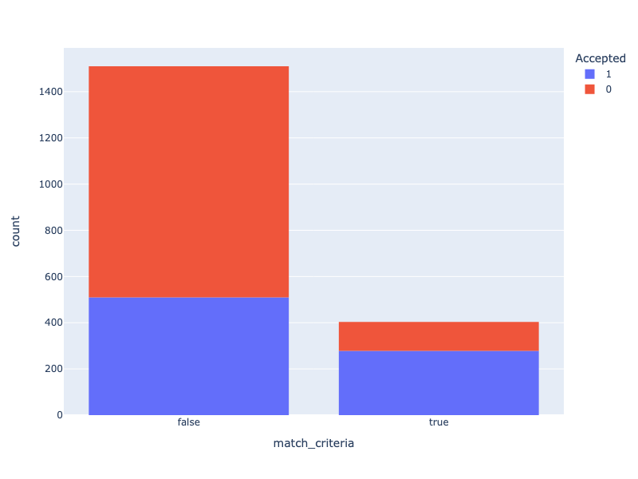

* __Use the same process to compare the acceptance rate between drivers who go to bars more than once a month and had passengers that were not a kid and had occupations other than farming, fishing, or forestry.__
```
Acceptance rate for people who go to bars more than once a month and 
	had passengers that were not a kid and had 
	occupations other than farming, fishing, or forestry
: 70.94%
Acceptance rate for people who do not match the above criteria: 29.79%
```
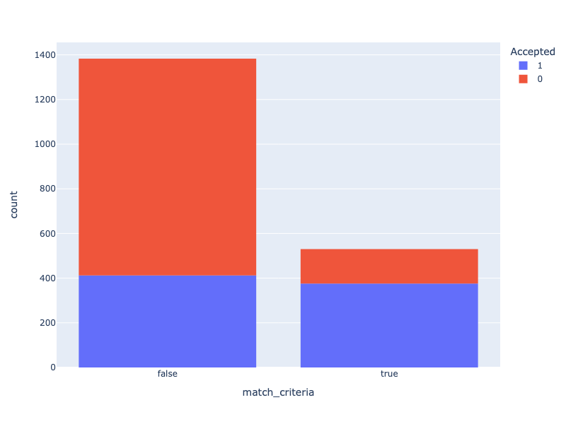

* __Compare the acceptance rates between those drivers who:__
    - __go to bars more than once a month, had passengers that were not a kid, and were not widowed *OR*__
    - __go to bars more than once a month and are under the age of 30 *OR*__
    - __go to cheap restaurants more than 4 times a month and income is less than 50K.__
```
Acceptance rate for people who 
	(go to bars more than once a month, had passengers that were not a kid, and were not widowed) OR 
	(go to bars more than once a month and are under the age of 30) OR 
	(go to cheap restaurants more than 4 times a month and income is less than 50K.)
:58.71%
Acceptance rate for people who do not match the above criteria: 29.99%
```
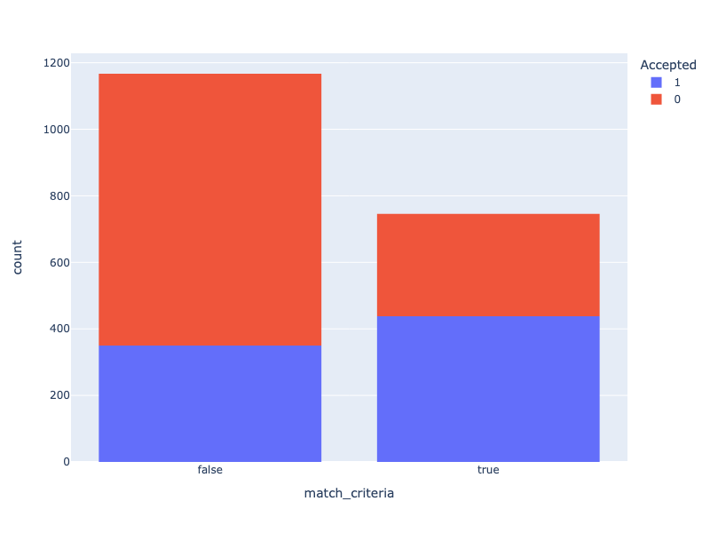

### Insights from the Observations:

#### 1. Frequency of Visits vs. Bar Coupon Acceptance
Drivers who visit bars three or more times a month show a strong positive correlation with accepting bar coupons. Without any other factors, bar coupons have a 41% acceptance rate, which jumps to 76% for drivers visiting bars more than three times a month. Therefore, **targeting frequent bar visitors is an effective strategy for bar-related coupons**.

#### 2. Effect of Age on Coupon Acceptance for Casual or Frequent Bar Visitors
Drivers over the age of 25 who visit bars casually (1 to 3 times) or frequently (4 or more times) also show a positive correlation with accepting bar coupons, with a 69% acceptance rate. Interestingly, there are drivers under 25 who accept bar coupons even though they are not legally allowed to drink at bars.

#### 3. Effect of Kids and Urban Area Residents
Casual or frequent bar-visiting drivers traveling without kids and working in non-rural settings demonstrate a strong correlation with accepting bar coupons, with a 71% acceptance rate.

#### 4. Social and Economic Factors on Acceptance Rate
Casual or frequent bar-visiting drivers who are in a relationship or are young and belong to a lower-income group also show a positive correlation with accepting bar coupons, with an acceptance rate of 59% compared to the other group’s 30%.

### Commonalities from the Observations:
1. Drivers who visit bars more than once show a positive inclination toward accepting bar coupons.
2. Being socially active and without responsibilities of kids also contributes positively to the acceptance rate.
3. Being young with limited disposable income slightly reduces the acceptance rate, but they still represent a good target market.

## Independent Investigation (Exploring Coupon Acceptance for Budget Friendly)

### Default Acceptance Rate
Without considering any feature, the acceptance rate for Budget Friendly Restaurant Coupons is __70.90%__.

### Acceptance Rate Visualization with respect to other features

| | | |  |
| -- | -- | -- | -- |
|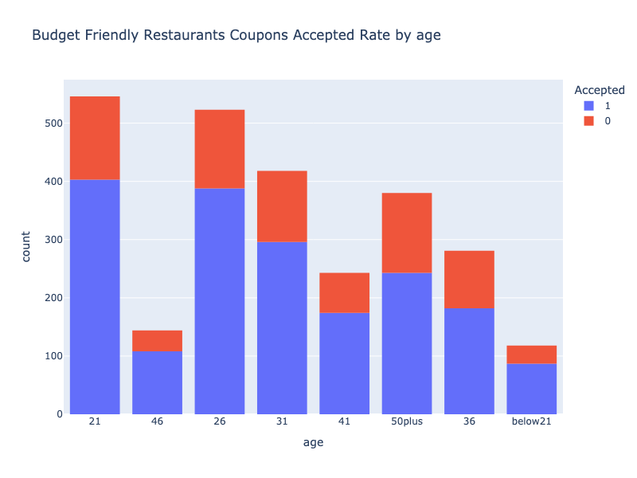|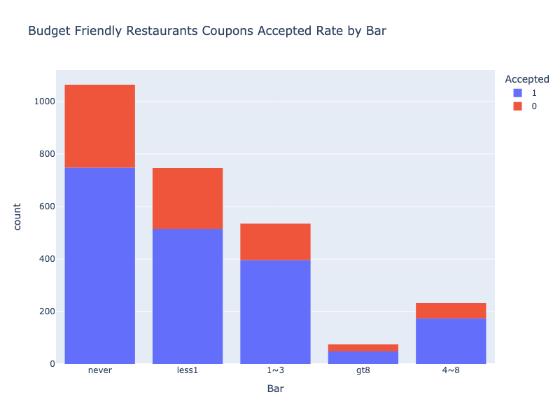|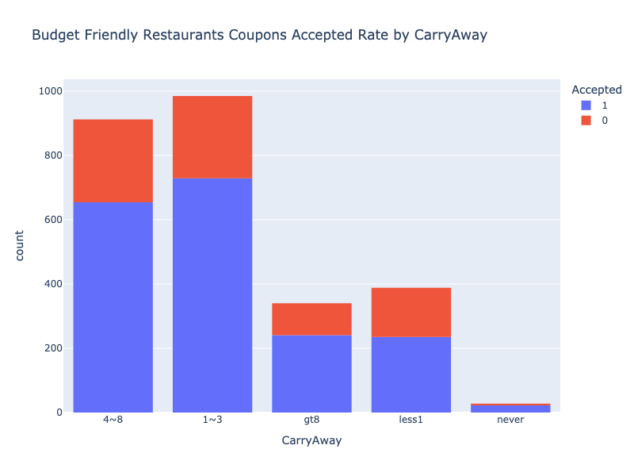|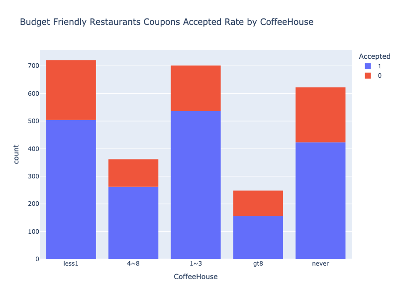|
|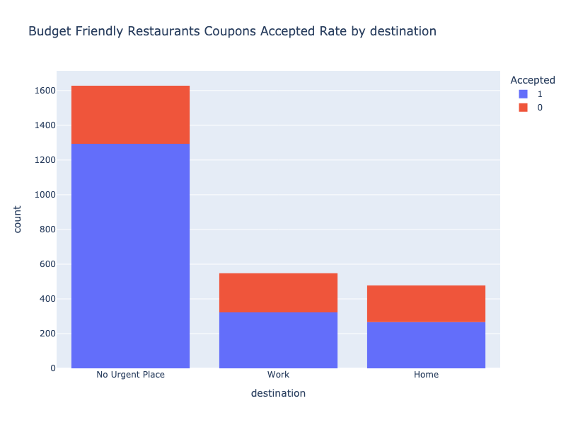|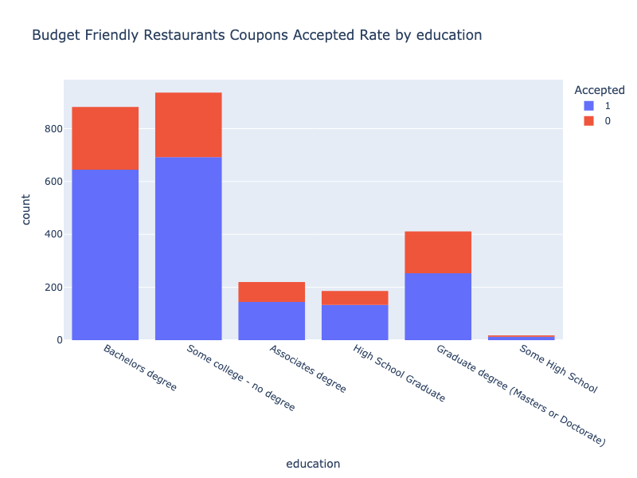|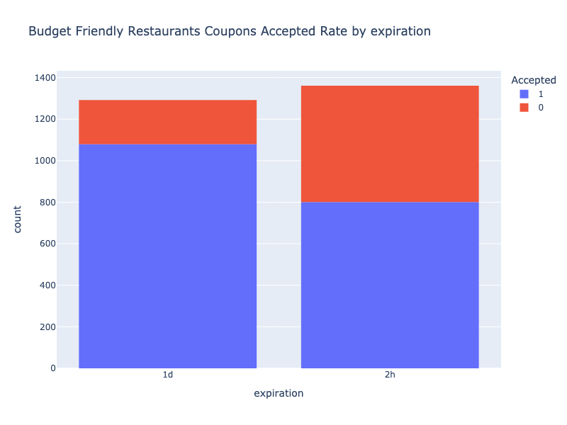|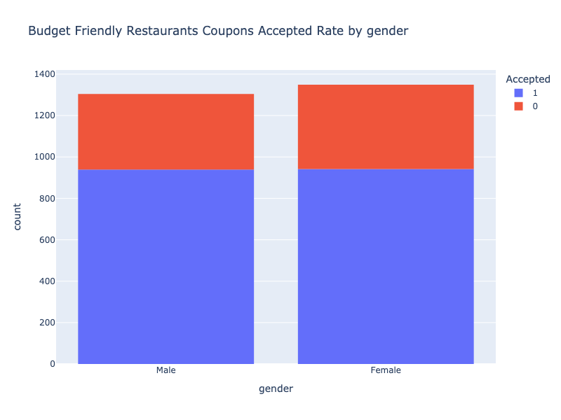|
|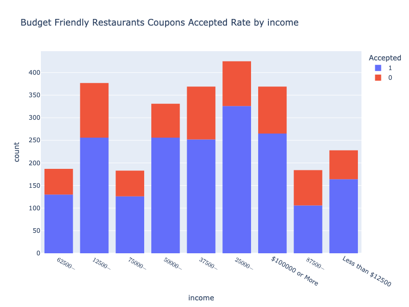|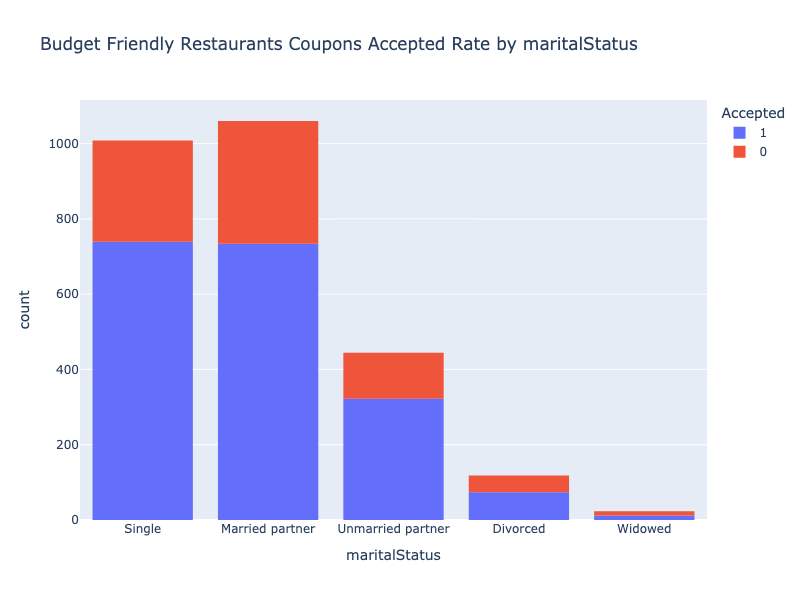|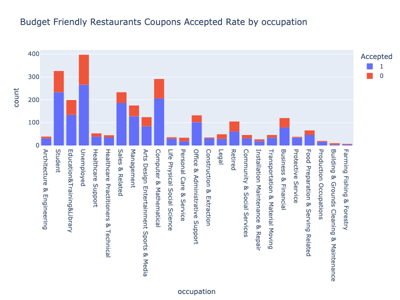|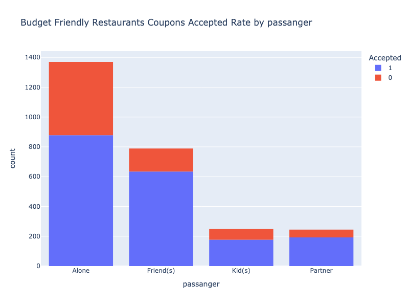|
|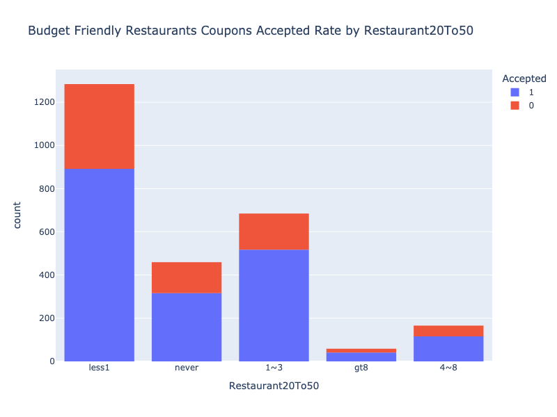|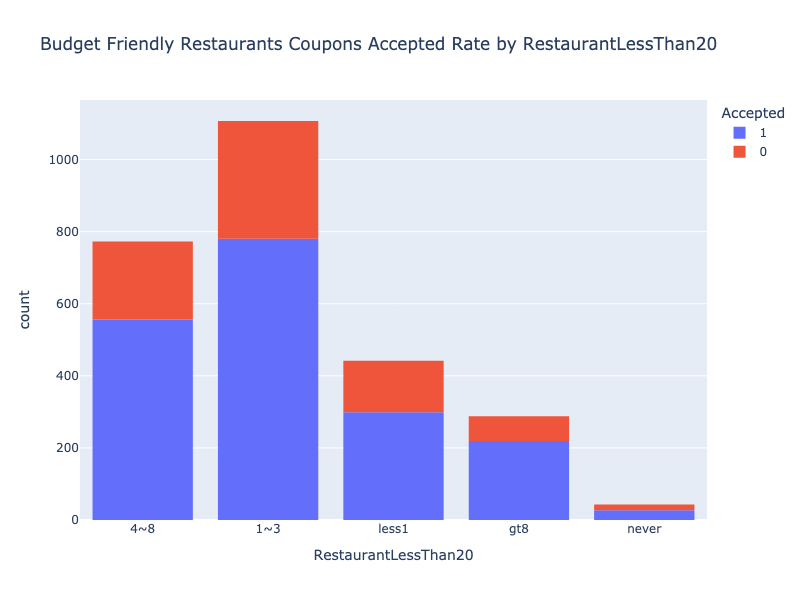|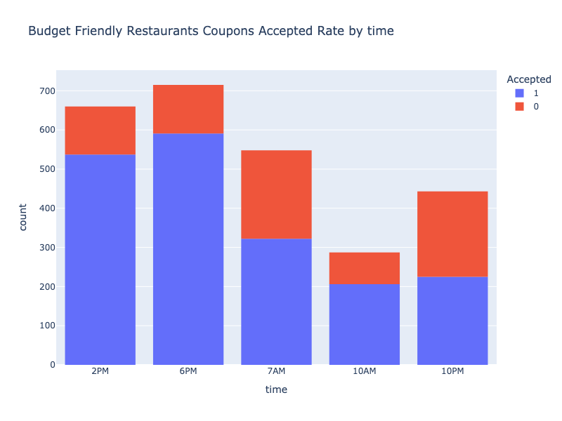|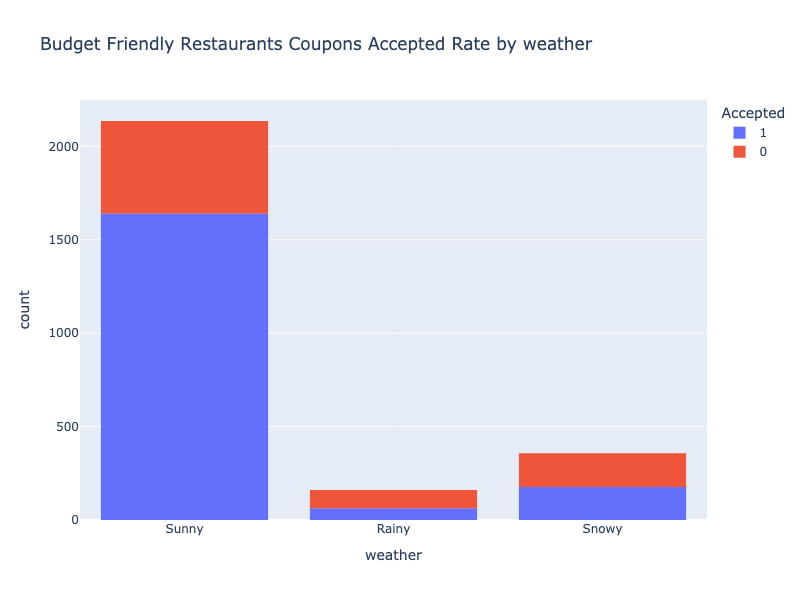|

```
From the plots it is quite clear that Budget Friendly restaurant coupons are quite popular amongst all categories.
```

### Deep Dive into features and group segregation

#### Effect by Time of the day
By dividing the time into two groups: lunch or dinner and others the acceptance rate increases to 82% during lunch and dinner hours whereas for other times the acceptance rate falls to 59%.
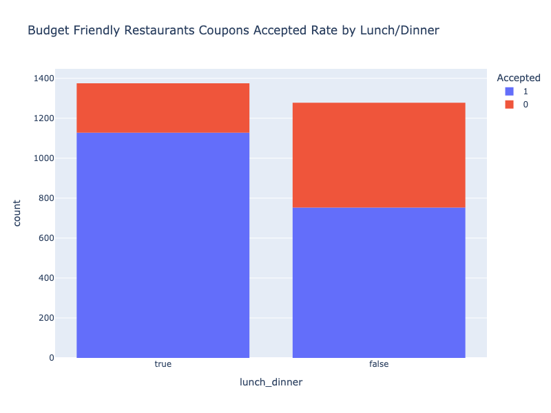

#### Effect of Destination (Home/Work/No Urgent Place) and Time of the day

Following conclusions are made when data is segregated into groups based on Lunch Dinner Hours as well as destination and here are some facts:

* During Lunch Dinner Hours
  - At home, the acceptance rate is 76%
  - At No Urgent Place, the acceptance rate shoots to 83%
  - At Work, acceptance rate is __0%__

* During off hours
  - At home, the acceptance rate is 37%
  - At No Urgent Place, the acceptance rate shoots to 70%
  - At Work, acceptance rate is __59%__

* For Reference when Time of the day is not considered:
	- At home, the acceptance rate is 56%
  - At No Urgent Place, the acceptance rate shoots to 80%
  - At Work, acceptance rate is __59%__

| | |
| -- | -- |
|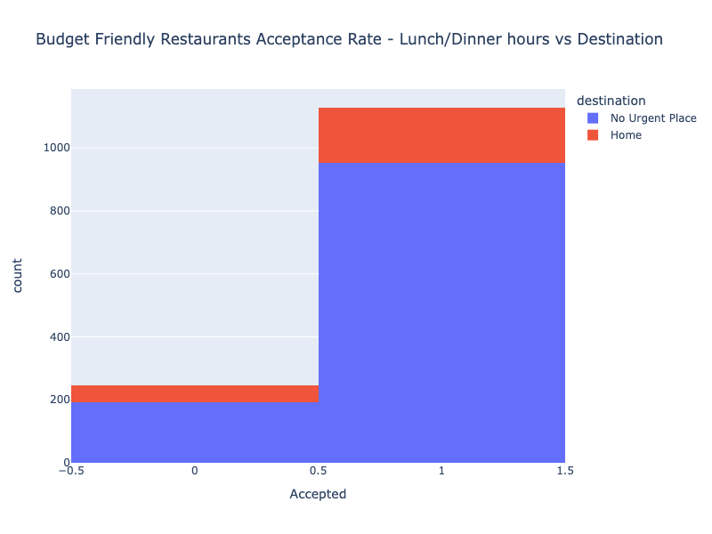|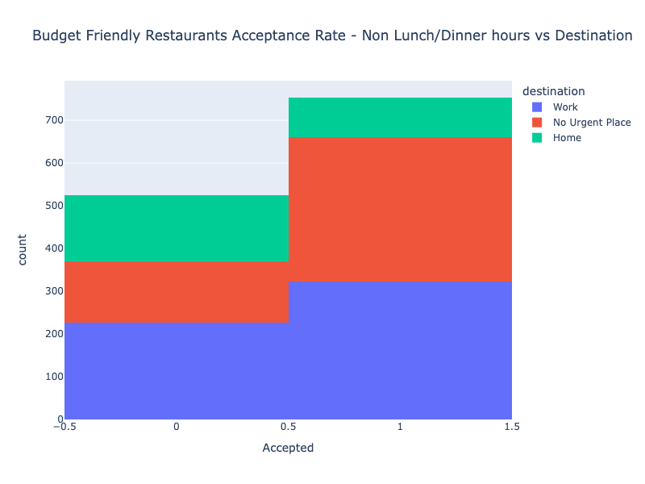|

## Conclusions
1. During Lunch/Dinner hours the acceptance rate is very high.
2. People at work are not interested in going to budget friendly restaurants for lunch/dinner. Dinner can be because no one is in office by that time and for lunch people might be more inclined towards take outs.
3. People neither at home or work are very receptacle to coupons irrespective of time.
4. People at work shows very less interest for budget-friendly restaurants even during non lunch/dinner hours.


## Next Steps
I would like to explore more relationships on coffee house coupons with other features and conclude some interesting insights.
