### **Final Report: Comparing Classifiers: Bank Marketing Dataset Analysis and Modeling**

---

#### **Objective:**
To analyze customer data and predict whether a client will subscribe to a term deposit (`yes` or `no`) using machine learning models. The goal was to evaluate and optimize the performance of four models: K-Nearest Neighbors (KNN), Decision Trees, Logistic Regression, and Support Vector Machines (SVM).

---

### **1. Data Overview**
The dataset is related to the marketing of bank products over the telephone. The dataset comes from the [UCI Machine Learning Repository](https://archive.ics.uci.edu/ml/datasets/bank+marketing). The data is from a Portuguese banking institution and is a collection of the results of multiple marketing campaigns.

> [!NOTE]  
> The dataset includes both full and sampled data files. Due to processing power limitations, I used the sampled data file; however, I believe the code in the notebooks should also be capable of handling the full data file.

**Dataset Size:** 4,119 entries, 21 columns.

**Features:**
- **Categorical** (e.g., `job`, `marital`, `education`, `month`, etc.)
- **Numerical** (e.g., `age`, `duration`, `campaign`, etc.)
- **Target Variable:** `y` (binary: `yes`, `no`).

**Imbalance in Target Variable:**
- `no`: 89.05%
- `yes`: 10.95%

    | |
    |----------|
    ||

---

### **2. Preprocessing**

- **Categorical Features**:
  - Low cardinality: OneHotEncoded (e.g., `housing`, `loan`).  

    | | | | | | |
    |----------|----------|----------|----------|----------|----------|
    |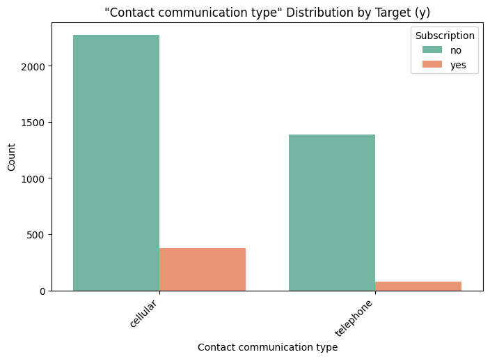|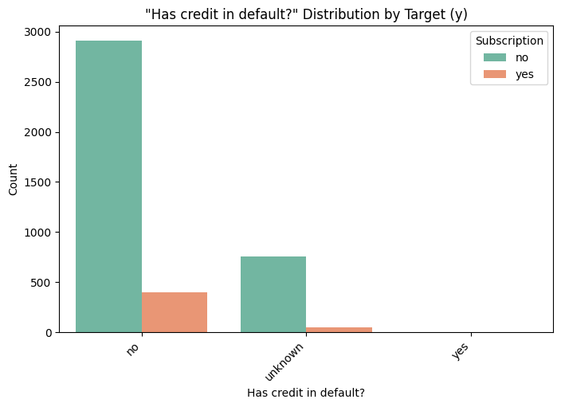|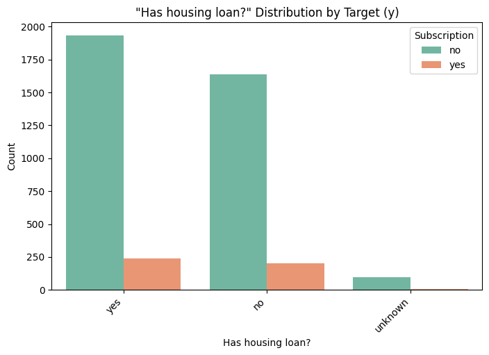|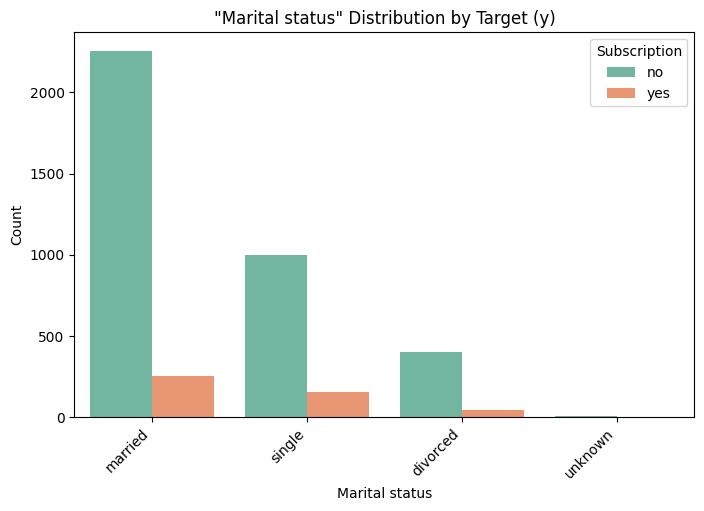|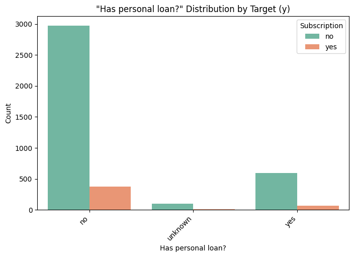|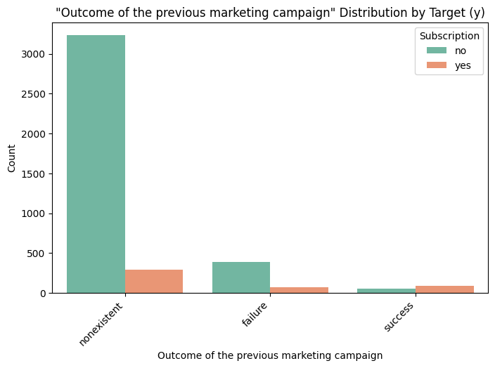|
    

  - High cardinality: LabelEncoded (e.g., `job`, `education`).

    | | | | |
    |----------|----------|----------|----------|
    |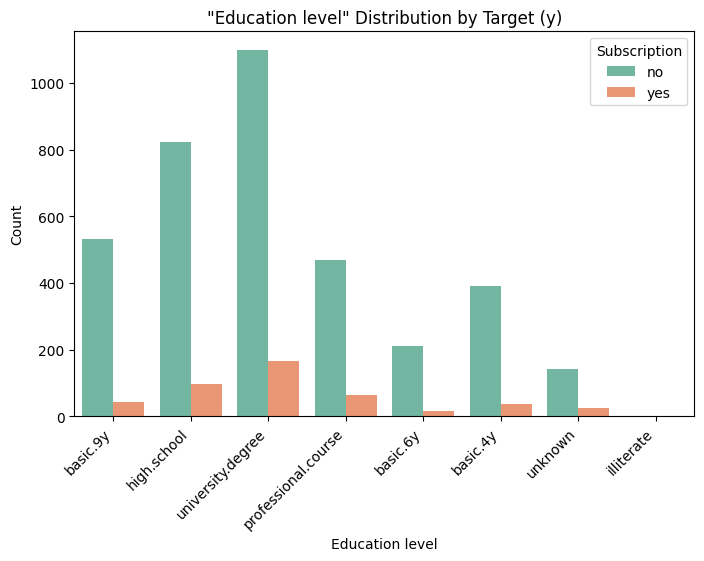|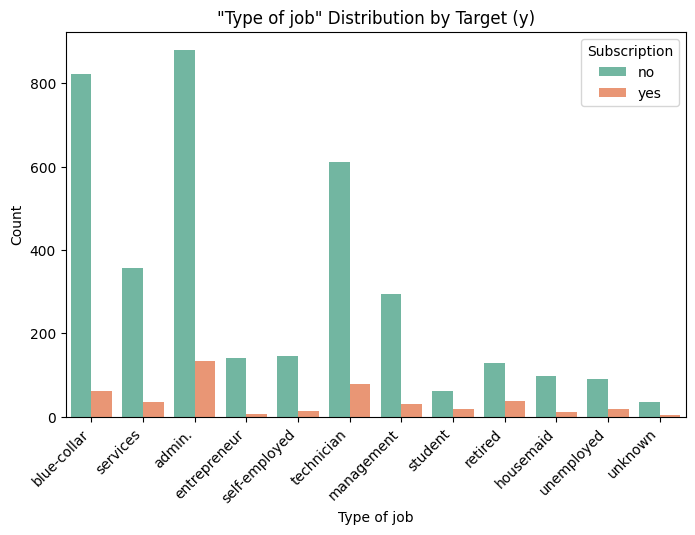|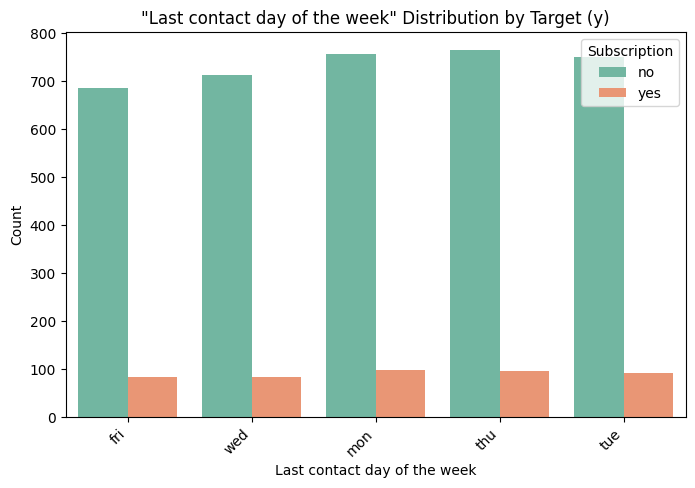|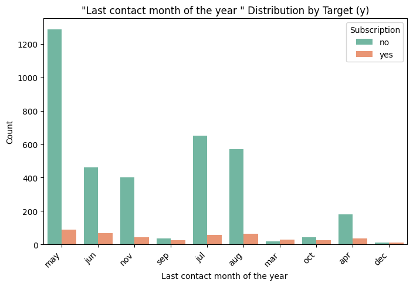|

- **Numerical Features**: Scaled using StandardScaler.

    | | | | | |
    |----------|----------|----------|----------|----------|
    |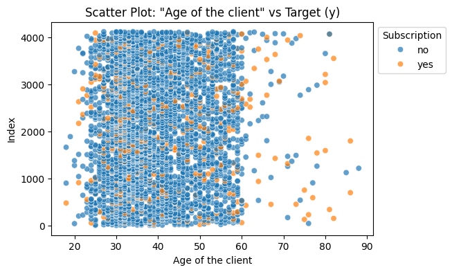|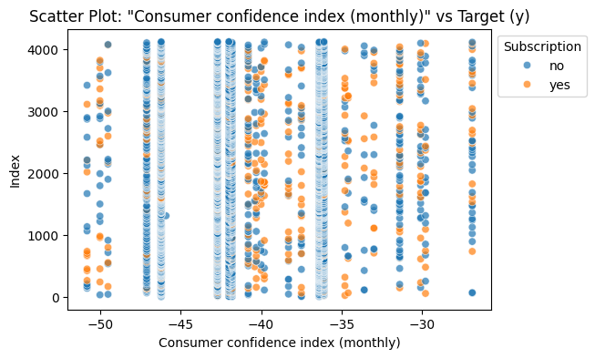|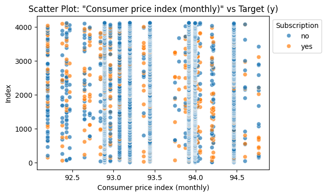|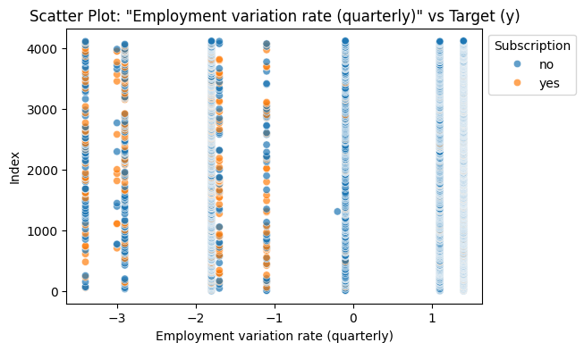|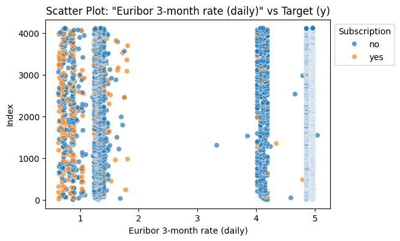|
    |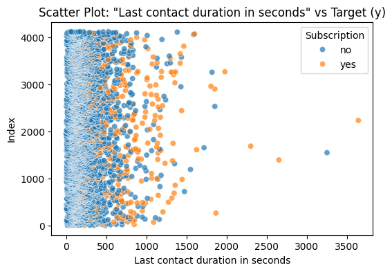|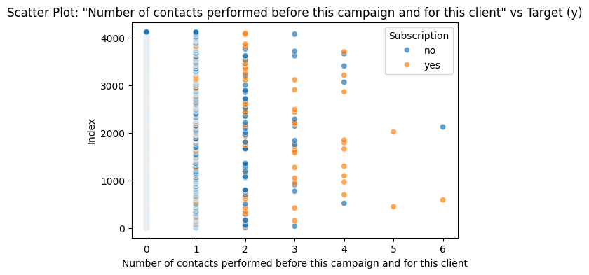|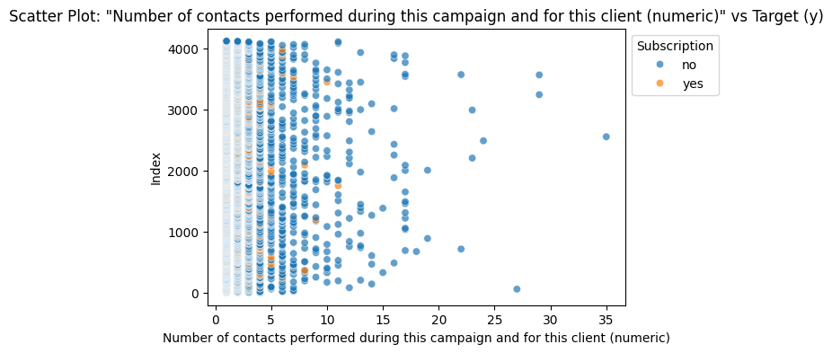|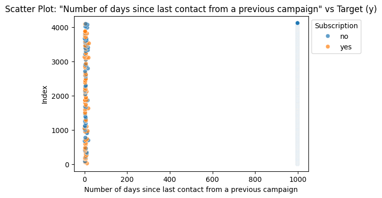|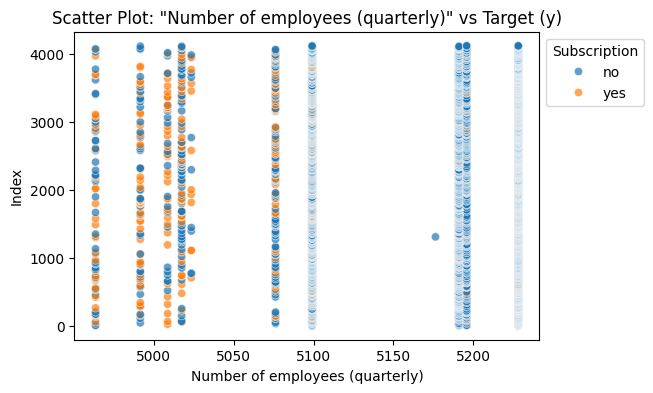|

- **Train-Test Split**: 70% training, 30% testing.
    | |
    |----------|
    ||

---

### **3. Models and Metrics**

#### **Models Evaluated**:
1. K-Nearest Neighbors (KNN)
2. Decision Trees
3. Logistic Regression
4. Support Vector Machines (SVM)

#### **Evaluation Metrics**:
- **Accuracy:** Overall correctness.
- **Precision:** Relevance of predictions for each class.
- **Recall:** Sensitivity to true positives.
- **F1-Score:** Balance between precision and recall.
- **AUC-ROC:** Ability to distinguish between classes.

---

### **4. Results**
| **Model**                                      | **Accuracy** | **Precision (no)** | **Precision (yes)** | **Recall (no)** | **Recall (yes)** | **F1-Score (no)** | **F1-Score (yes)** | **AUC-ROC** |
|------------------------------------------------|--------------|---------------------|----------------------|------------------|------------------|--------------------|--------------------|-------------|
| **KNN** ({'n_neighbors': 9, 'weights': 'distance'}) | 0.901       | 0.912               | 0.633                | 0.984            | 0.230            | 0.947              | 0.337              | 0.831       |
| **Decision Tree** ({'max_depth': 10, 'min_samples_split': 10}) | 0.900       | 0.934               | 0.556                | 0.956            | 0.444            | 0.945              | 0.494              | 0.812       |
| **Logistic Regression** ({'C': 1, 'solver': 'liblinear'}) | 0.909       | 0.927               | 0.646                | 0.975            | 0.378            | 0.950              | 0.477              | **0.924**   |
| **SVM** ({'C': 0.1, 'kernel': 'linear'})       | 0.908       | 0.921               | 0.662                | 0.980            | 0.319            | 0.950              | 0.430              | 0.922       |
| **Baseline KNN**                                | 0.892       | 0.911               | 0.508                | 0.973            | 0.230            | 0.941              | 0.316              | 0.806       |
| **Baseline Decision Tree**                     | 0.884       | 0.939               | 0.473                | 0.930            | 0.511            | 0.935              | 0.491              | 0.721       |
| **Baseline Logistic Regression**               | 0.909       | 0.927               | 0.646                | 0.975            | 0.378            | 0.950              | 0.477              | **0.924**   |
| **Baseline SVM**                                | 0.906       | 0.916               | 0.679                | 0.985            | 0.267            | 0.949              | 0.383              | 0.907       |

#### Confusion Matrices

  | **K-Nearest Neighbor (Default)** | **Decision Tree (Default)** | **Logistic Regression (Default)** | **Support Vector Machine (Default)** |
  |------------------------|-------------------|-------------------------|----------------------------|
  |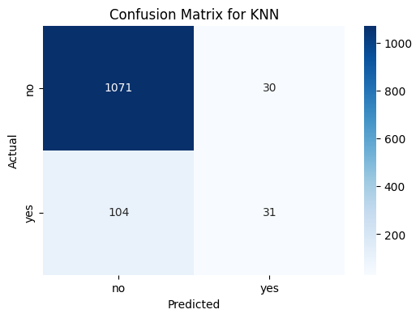|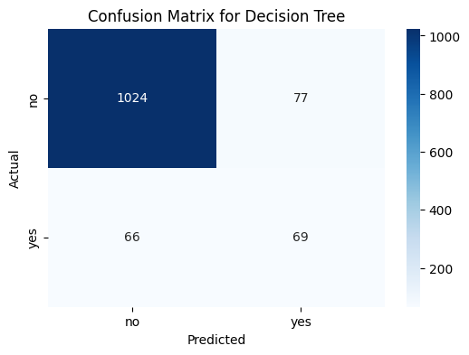||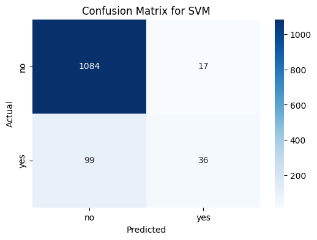|
  | **K-Nearest Neighbor (Optimized)** | **Decision Tree (Optimized)** | **Logistic Regression (Optimized)** | **Support Vector Machine (Optimized)** |
  |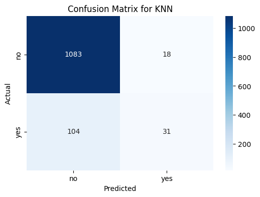||||

  #### Scores
  | **Accuracy** | **Precision (yes)** | **Recall (yes)** | **AUC ROC** | **F1** |
  | ------------ | ------------------- | ---------------- | ----------- | ------ |
  |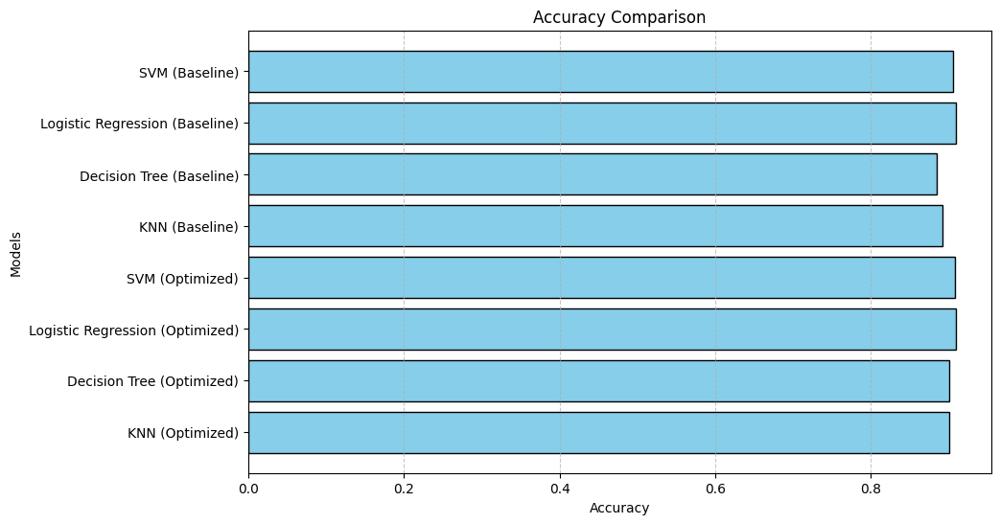|.png)|.png)|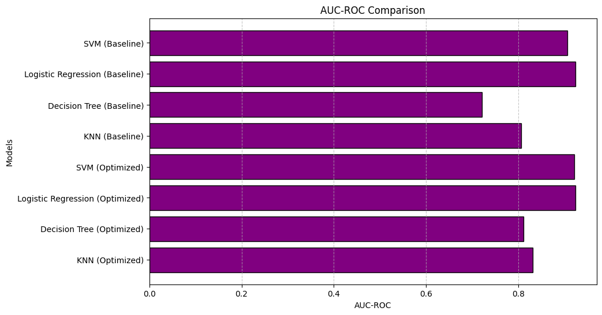|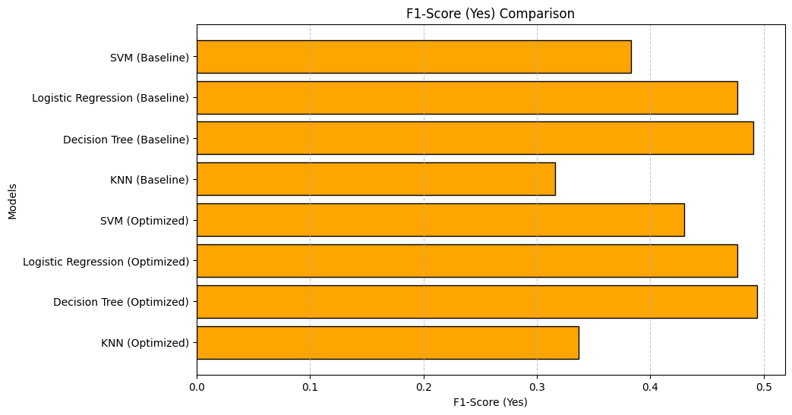|

---

### **5. Key Insights**

1. **Logistic Regression (Optimized)**:
   - Best overall model with an AUC-ROC of **0.924** and high accuracy (90.9%).
   - Balances recall for both `yes` and `no`.

2. **Decision Tree (Optimized)**:
   - High recall for `yes` (44.4%), making it suitable for capturing minority class instances.

3. **SVM (Optimized)**:
   - High precision for `yes` (66.2%), indicating fewer false positives.

4. **KNN (Optimized)**:
   - Moderate performance but struggles with recall for `yes` (23%).

---

### **6. Next Steps**

1. **Business Application**:
   - Use **Logistic Regression** as the primary model for predicting term deposit subscriptions.
   - Deploy **Decision Tree** in scenarios where recall for `yes` (minority class) is critical, such as in targeted marketing campaigns.

2. **Class Imbalance Mitigation**:
   - Implement techniques like **SMOTE (Synthetic Minority Oversampling Technique)** to improve recall for `yes` and ensure better class balance.

3. **Feature Engineering**:
   - Explore additional features or create interactions between existing ones to enhance model performance.
   
4. **Model Monitoring**:
   - Continuously monitor the model’s performance in production.
   - Use recent data for retraining the model periodically to account for changing customer behaviors.

5. **Ensemble Models**:
   - Experiment with ensemble techniques like **Random Forests** or **Gradient Boosting Machines** to improve prediction accuracy and recall further.

---
### Links to Notebooks
* [Business Understanding](./notebooks/01_BusinessUnderstanding.ipynb)
* [Data Understanding](./notebooks/02_DataUnderstanding.ipynb)
* [Data Preparation](./notebooks/03_DataPreparation.ipynb)
* [Data Modelling and Evaluation](./notebooks/04_DataModellingAndEvaluation.ipynb)
---